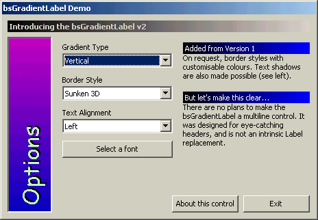

## bsGradientLabel v2

### Description

It's exactly what its name suggests: a label with a gradient background. You can select from 3 gradient styles, caption alignment, custom colours for both the gradient and text, label rotation (horizontal and vertical) and almost any font (some will not work when the label is vertical). If you like it, please give me a good vote. --- NOW SUPPORTS: border styles and text shadows. ---
 
### More Info
 

             |
---                |---
**Submitted On**   |2002-03-14 14:32:42
**By**             |[Headdy](https://github.com/Planet-Source-Code/PSCIndex/blob/master/ByAuthor/headdy.md)
**Level**          |Advanced
**User Rating**    |4.7 (33 globes from 7 users)
**Compatibility**  |VB 5\.0, VB 6\.0
**Category**       |[Custom Controls/ Forms/  Menus](https://github.com/Planet-Source-Code/PSCIndex/blob/master/ByCategory/custom-controls-forms-menus__1-4.md)
**World**          |[Visual Basic](https://github.com/Planet-Source-Code/PSCIndex/blob/master/ByWorld/visual-basic.md)
**Archive File**   |[bsGradient621303142002\.zip](https://github.com/Planet-Source-Code/headdy-bsgradientlabel-v2__1-32401/archive/master.zip)

